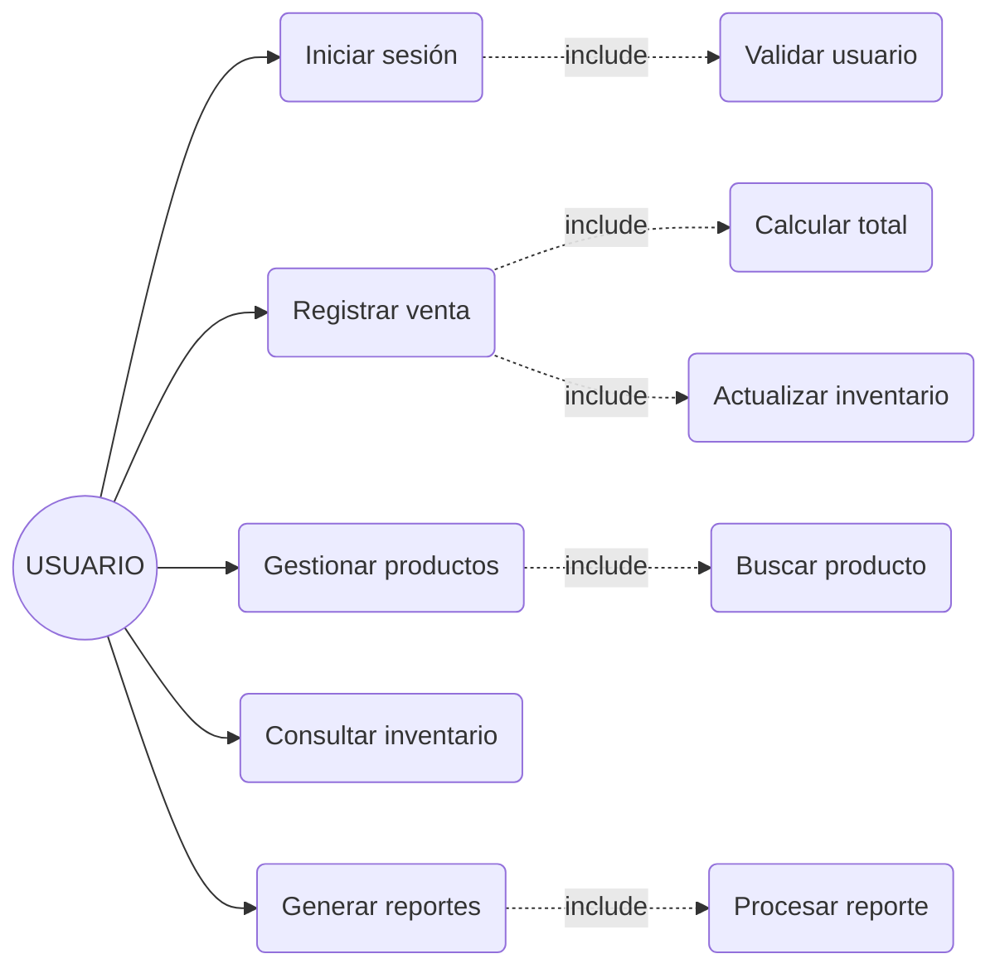
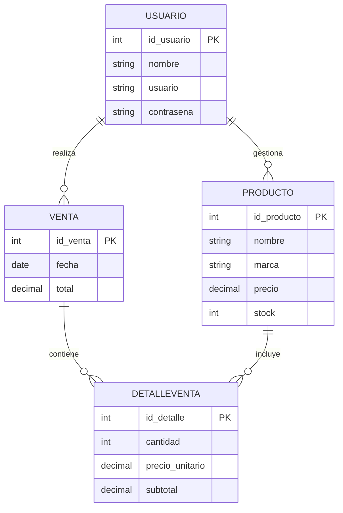

# UNIVERSIDAD TECNOLÓGICA DEL PERÚ

**Curso Integrador I: Sistemas Software**

**Tema:** Avance de Proyecto Final (1-2)

**Caso:** Sistema de Control de Ventas para Negocios de Laptops y Computadoras

**Sección:** 28648

**Integrantes:** Diego Alonso Mejia Huisacayna

Fabian Mauricio Chaisa Arapa

Duvan Isai Davila Guerra

Gabriela Ysabel Romero Chirinos

Bryan Francescoly Zeballos Ticona

**Docente:** Juan Ramirez Ticona

Arequipa, Perú

2026

---

## ÍNDICE

1. Análisis del contexto
1.1 Contexto de la empresa
1.2 Problema identificado
1.3 Alcance de la solución
1.4 Visión
1.5 Misión
1.6 Entorno
1.7 Estrategias de la Empresa
1.7.1 Estrategia de Digitalización
1.7.2 Estrategia de Diferenciación
1.7.3 Estrategia de Reducción de Costos
1.8 Planes de la Empresa
1.8.1 Plan de Desarrollo del Sistema
1.8.2 Plan de Implementación
1.8.3 Plan de Capacitación
2. Análisis Del Sistema
2.1 Descripción General del Sistema
2.2 Actores del Sistema
2.3 Casos de Uso del Sistema
2.3.1 Lista de Casos de Uso
2.3.2 Caso de Uso: Iniciar Sesión
2.3.3 Caso de Uso: Registrar Venta
2.3.4 Caso de Uso: Gestionar Productos
2.3.5 Caso de Uso: Consultar Inventario
2.3.6 Caso de Uso: Generar Reportes
2.3.7 Diagrama General de Casos de Uso
2.4 Diagramas de Entidad Relación
2.5 Requisitos Funcionales (RF)
2.6 Requisitos No Funcionales (RNF)
2.7 Priorización de Requisitos
2.8 Supuestos y Restricciones
2.9 Criterios de Aceptación
3. Diseño de la solución
3.1 Diseño de Arquitectura del Sistema
3.2 Diseño de Base de Datos
3.3 Diseño de Interfaces de Usuario
4. Lean Canvas
5. Mockups
6. Porcentaje de Avance en GitHub

---

## 1. Análisis del contexto

### 1.1 Contexto de la empresa

Los negocios pequeños de venta de laptops y computadoras suelen manejar sus ventas e inventario de forma manual (cuadernos o Excel), lo que dificulta el control y la organización del negocio.

### 1.2 Problema identificado

Falta de un sistema digital para:

* Registrar ventas correctamente
* Controlar el stock
* Generar reportes

Esto ocasiona errores, pérdida de información y mala toma de decisiones.

### 1.3 Alcance de la solución

Sistema web en Java que permitirá:

* Registrar ventas
* Gestionar productos
* Controlar inventario en tiempo real
* Generar reportes

Dirigido a pequeños negocios, con uso simple.

### 1.4 Visión

Ser una solución simple y confiable para mejorar la gestión de ventas e inventario en negocios tecnológicos.

### 1.5 Misión

Desarrollar un sistema web en Java que facilite el control de ventas, productos e inventario.

### 1.6 Entorno

* **Tecnológico:** equipos básicos, bajo nivel digital
* **Económico:** presupuesto limitado
* **Social:** usuarios con conocimientos básicos

### 1.7 Estrategias de la Empresa

Las estrategias están orientadas a mejorar la gestión del negocio, incrementar las ventas y optimizar el control interno mediante el uso del sistema propuesto.

#### 1.7.1 Estrategia de Digitalización

Reemplazar procesos manuales

#### 1.7.2 Estrategia de Diferenciación

Mejor organización y rapidez

#### 1.7.3 Estrategia de Reducción de Costos

Uso de tecnologías gratuitas (Java, HTML, SQLite)

### 1.8 Planes de la Empresa

Los planes definen las acciones necesarias para implementar y poner en funcionamiento el sistema.

#### 1.8.1 Plan de Desarrollo del Sistema

* Análisis
* Diseño
* Programación

#### 1.8.2 Plan de Implementación

* Instalación
* Pruebas

#### 1.8.3 Plan de Capacitación

Capacitar al usuario en el uso básico del sistema.

---

## 2. Análisis Del Sistema

### 2.1 Descripción General del Sistema

El sistema es una aplicación web en Java que permite registrar ventas, gestionar productos, controlar el inventario y generar reportes en un negocio de laptops y computadoras.

Funciona desde un navegador web con una interfaz sencilla, utilizando Java (Servlets) en el backend y HTML, CSS y JavaScript en el frontend, con base de datos SQLite y PostgreSQL.

Está diseñado para ser fácil de usar y ayudar a pequeños negocios a mejorar su organización y control de información.

### 2.2 Actores del Sistema

**Usuario:** Es la persona que utiliza el sistema y tiene acceso a todas las funcionalidades, como registrar ventas, gestionar productos, consultar el inventario y generar reportes.

### 2.3 Casos de Uso del Sistema

#### 2.3.1 Lista de Casos de Uso

* Iniciar sesión
* Registrar venta
* Gestionar productos
* Consultar inventario
* Generar reportes

#### 2.3.2 Caso de Uso: Iniciar Sesión

* **Actor:** Usuario
* **Descripción:** Permite al usuario ingresar al sistema mediante sus credenciales.
* **Flujo principal:**
1. El usuario abre el sistema
2. Ingresa usuario y contraseña
3. El sistema valida los datos
4. El sistema permite el acceso

* **Flujo alternativo:**
* Si los datos son incorrectos $\rightarrow$ muestra mensaje de error

* **Resultado:** Usuario accede al sistema

#### 2.3.3 Caso de Uso: Registrar Venta

* **Actor:** Usuario
* **Descripción:** Permite registrar la venta de productos.
* **Flujo principal:**
1. El usuario inicia sesión
2. Accede a “Registrar venta”
3. Selecciona producto
4. Ingresa cantidad
5. El sistema calcula el total automáticamente
6. El usuario confirma la venta
7. El sistema guarda la venta
8. El sistema actualiza el stock

* **Flujo alternativo:**
* Si no hay stock $\rightarrow$ el sistema muestra alerta

* **Resultado:** Venta registrada y stock actualizado

#### 2.3.4 Caso de Uso: Gestionar Productos

* **Actor:** Usuario
* **Descripción:** Permite agregar, editar o eliminar productos.
* **Flujo principal:**
1. El usuario accede al módulo productos
2. Selecciona acción (agregar / editar / eliminar)
3. Ingresa o modifica datos
4. El sistema guarda los cambios

* **Flujo alternativo:**
* Si faltan datos $\rightarrow$ el sistema solicita completarlos

* **Resultado:** Productos actualizados

#### 2.3.5 Caso de Uso: Consultar Inventario

* **Actor:** Usuario
* **Descripción:** Permite ver el stock disponible.
* **Flujo principal:**
1. El usuario accede al inventario
2. El sistema muestra lista de productos
3. El usuario puede buscar o filtrar

* **Resultado:** Visualización del stock

#### 2.3.6 Caso de Uso: Generar Reportes

* **Actor:** Usuario
* **Descripción:** Permite ver reportes de ventas.
* **Flujo principal:**
1. El usuario accede a reportes
2. Selecciona tipo (ventas o ingresos)
3. El sistema procesa datos
4. Muestra el reporte

* **Flujo alternativo:**
* Si no hay datos $\rightarrow$ muestra “sin registros”

* **Resultado:** Reporte generado

#### 2.3.7 Diagrama General de Casos de Uso

---

### 2.4 Diagramas de Entidad Relación

---

### 2.5 Requisitos Funcionales (RF)

* **RF01: Login** El sistema debe permitir al usuario iniciar sesión mediante usuario y contraseña para acceder a las funcionalidades.
* **RF02: Registro de ventas** El sistema debe permitir registrar ventas de productos, ingresando cantidad y calculando automáticamente el total.
* **RF03: CRUD de productos** El sistema debe permitir agregar, editar y eliminar productos con datos como nombre, precio y stock.
* **RF04: Ver inventario** El sistema debe mostrar la lista de productos con su stock actualizado en tiempo real.
* **RF05: Reportes** El sistema debe generar reportes de ventas e ingresos para apoyar la toma de decisiones.
* **RF06: Cálculo automático** El sistema debe calcular automáticamente el total de cada venta según los productos y cantidades.

### 2.6 Requisitos No Funcionales (RNF)

#### Usabilidad

* **RNF01:** El sistema debe ser fácil de usar e intuitivo para usuarios con conocimientos básicos.
* **RNF02:** La interfaz debe ser clara, organizada y de fácil navegación.

#### Rendimiento

* **RNF03:** El sistema debe responder en un tiempo menor a 3 segundos en operaciones comunes.
* **RNF04:** El sistema debe manejar múltiples registros sin presentar errores visibles.

#### Seguridad

* **RNF05:** El sistema debe requerir autenticación mediante usuario y contraseña.
* **RNF06:** El sistema debe restringir el acceso a usuarios no autorizados.

#### Compartibilidad

* **RNF07:** El sistema debe funcionar en computadoras con sistema operativo Windows.
* **RNF08:** El sistema debe ejecutarse correctamente en equipos de bajos recursos (o medianos).

#### Disponibilidad

* **RNF09:** El sistema debe poder funcionar en modo local sin necesidad de conexión a internet.

### 2.7 Priorización de Requisitos

* **Alta prioridad:** Inicio de sesión, registro de ventas y control de inventario, ya que son funciones esenciales del sistema.
* **Media prioridad:** Gestión de productos y generación de reportes, necesarias para la administración del negocio.
* **Baja prioridad:** Personalización del sistema y mejoras visuales.

### 2.8 Supuestos y Restricciones

#### Supuestos

* El usuario tiene conocimientos básicos de informática.
* El negocio cuenta con al menos una computadora.

#### Restricciones

* El sistema será desarrollado en Java como tecnología principal.
* El tiempo de desarrollo es limitado (17 semanas).
* Los recursos económicos son reducidos.

### 2.9 Criterios de Aceptación

El sistema será considerado funcional cuando:

* Permita iniciar sesión correctamente.
* Permita registrar ventas sin errores.
* Actualice el inventario automáticamente.
* Visualizar reportes de ventas e ingresos.
* Sea fácil de usar para el usuario.

---

## 3. Diseño De La Solución

### 3.1 Diseño de Arquitectura del Sistema

El sistema seguirá una arquitectura cliente-servidor. El usuario accederá mediante un navegador web, utilizando una interfaz desarrollada con HTML, CSS y JavaScript.

Las solicitudes serán procesadas en el backend desarrollado en Java (Servlets), donde se gestionará la lógica del sistema, como el registro de ventas, validación de datos y control del inventario.

La información será almacenada en una base de datos SQLite como una de las alternativas de solución básicas, permitiendo un sistema simple, eficiente y de bajo costo, pero en la solución final elegida será con PostgreSQL.

### 3.2 Diseño de Base de Datos

El sistema utilizará una base de datos relacional sencilla con las siguientes tablas:

* **Usuarios:** almacena los datos de acceso al sistema.
* **Productos:** registra los productos (nombre, marca, precio, stock).
* **Ventas:** guarda cada venta realizada.
* **DetalleVenta:** contiene los productos y cantidades de cada venta.

Este diseño permite mantener la organización de los datos y facilita la generación de reportes y el control del inventario.

### 3.3 Diseño de Interfaces de Usuario

El sistema contará con interfaces simples e intuitivas para facilitar su uso. Las principales pantallas serán:

* Inicio de sesión
* Registro de ventas
* Gestión de productos
* Consulta de inventario
* Reportes

El diseño será claro y fácil de usar, pensado para usuarios con conocimientos básicos.

---

## 4. Lean Canvas

| **Problema** | **Segmento de Clientes** | **Propuesta de valor única** | **Solución** | **Canales** |
| --- | --- | --- | --- | --- |
| Desorden en ventas, mal control de stock, falta de reportes. | Pequeños negocios tecnológicos. | Controla tus ventas e inventario de forma rápida y sencilla, evita pérdidas de stock y toma mejores decisiones sin conocimientos técnicos. | Sistema web en Java. | Instalación directa, recomendaciones |
| **Métricas Clave** | **Estructura de costos** | **Fuente de ingresos** | **Ventaja Injusta** |
| Ventas registradas, Uso del sistema | Desarrollo del sistema, Mantenimiento | Venta del sistema + soporte | Simple, Barato, Enfocado en laptops |

---

## 5. Mockups

### 5.1. Pantalla de Login

*(Aquí se incluye la imagen correspondiente al Mockup de Login)*

### 5.2. Pantalla de Productos

*(Aquí se incluye la imagen correspondiente al Inventario de Productos)*

#### 5.2.1. Pantalla de Productos (Nuevo Producto)

*(Aquí se incluye la interfaz emergente para Registrar Nuevo Producto)*

### 5.3. Pantalla de Ventas

*(Aquí se incluye la imagen correspondiente al Registro de Ventas POS)*

#### 5.3.1. Pantalla de Ventas (Producto agregado)

*(Aquí se incluye el estado de la venta con artículos añadidos en el detalle)*

### 5.4. Pantalla de Inventario

*(Aquí se incluyen los paneles de Alertas de Reabastecimiento y Estado General de Inventario)*

### 5.5. Pantalla de Reportes

*(Aquí se visualizan las métricas de Analítica, Reportes e Ingresos Mensuales)*

---

## 6. Porcentaje de Avance en GitHub

### 6.1. Porcentaje de más del 50% de Java de la Solución 1

*(Aquí se incluye la captura de pantalla del repositorio con la estructura de archivos inicial y el desglose de lenguajes donde destaca Java con un 57.2%)*

### 6.2. Porcentaje de más del 50% de Java de la Solución 2

*(Aquí se incluye la evidencia correspondiente a la Solución 2)*

### 6.3. Porcentaje de más del 50% de Java de la Solución 3

*(Aquí se incluye la evidencia correspondiente a la Solución 3)*